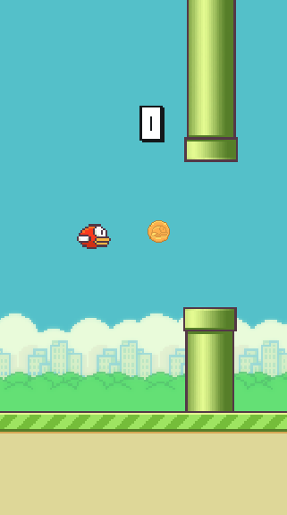

# FlappyBird
 Réplica del clásico FlappyBird tan similar como fue posible. Ejercicio académico de introducción a Unity.

**Modificación:**

Se incluyeron monedas que aparecen con una probabilidad del 30% a una altura aleatoria entre las tuberías. Cada moneda recogida suma +2 puntos al puntaje general.

Se exportó para Android. El APK se encuentra disponible en el siguiente enlace: https://upbeduco-my.sharepoint.com/personal/alix_angarita_2013_upb_edu_co/_layouts/15/onedrive.aspx
